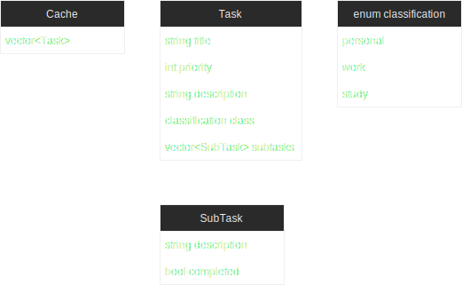

# Task Scheduler

Authors: [Adil Mohiuddin](https://github.com/advilm), [Jian Darugar](https://github.com/jiandarugar), [Leyna Diep](https://github.com/lxyna), [Saul Mendoza](https://github.com/smendoza07)

## Phase I

As students, time management is crucial to succeeding in our classes so a task scheduler is something that we can all make use of. It is also a way to keep track of all assignment due dates in a central location instead of having to check each class syllabus every day. It is also important to dedicate time to rest and relaxation so having a reminder on a scheduler that it is time to step away from the desk will help to keep students balanced. This project is interesting to us of how busy daily life can be. Time management is crucial for productivity throughout the day, so this project will be able to greatly benefit the user.

The programming languages we plan to use are JavaScript for the frontend and Python for the backend.

Technologies:
* Frontend
    * [React](https://reactjs.org/) - Declarative, efficient, and flexible JavaScript library for building user interfaces
    * [Next.js](https://nextjs.org/) - Framework that allows for server-side rendering and static site generation
    * [Mantine](https://mantine.dev/) - Library with pre-made UI components
* Backend
    * [Flask](https://flask.palletsprojects.com/) - Can be used to make a basic API easily
    * [SQLAlchemy](https://www.sqlalchemy.org/) - Gives application developers the full power and flexibility of SQL.
    * [SQLite](https://www.sqlite.org/index.html) - C-language library that implements a small, fast, self-contained, high-reliability, full-featured, SQL database engine.

The project JASL is proposing is to create a task scheduler that allows the reader to tell when they should complete a task. The scheduler will remember the user's tasks that the user sets and order them by priority. Users should be able to create tasks in this program with corresponding subtasks. If the user felt the task was completed they can check off that they completed it on their task list. The input for the project would be people uploading tasks with a title, description, and priority, and the output would be tasks added to the scheduler.

## Class Diagram

 > ## Phase II
 > You will need to schedule a check-in for the second scrum meeting with the same reader you had your first scrum meeting with (using Calendly). Your entire team must be present. This meeting will occur on week 8 during lab time.
 > * Before the meeting you should perform a sprint plan like you did in Phase I.
 > * You should also update this README file by adding the following:
 >   * What design pattern(s) did you use? For each pattern you must explain in 4-5 sentences:
 >     * Why did you pick this pattern? And what feature did you implement with it?
 >     * How did the design pattern help you write better code?
 >   * An updated class diagram that reflects the design pattern(s) you used. You may combine multiple design patterns into one diagram if you'd like, but it needs to be clear which portion of the diagram represents which design pattern (either in the diagram or in the description).
 >   * Make sure your README file (and Project board) are up-to-date reflecting the current status of your project. Previous versions of the README file should still be visible through your commit history.
>
> During the meeting with your reader you will discuss:
 > * How effective your last sprint was (each member should talk about what they did)
 > * Any tasks that did not get completed last sprint, and how you took them into consideration for this sprint
 > * Any bugs you've identified and created issues for during the sprint. Do you plan on fixing them in the next sprint or are they lower priority?
 > * What tasks you are planning for this next sprint.

 > ## Final deliverable
 > All group members will give a demo to the TA/reader during lab time. The TA/reader will check the demo and the project GitHub repository and ask a few questions to all the team members.
 > Before the demo, you should do the following:
 > * Complete the sections below (i.e. Screenshots, Installation/Usage, Testing)
 > * Plan one more sprint (that you will not necessarily complete before the end of the quarter). Your In-progress and In-testing columns should be empty (you are not doing more work currently) but your TODO column should have a full sprint plan in it as you have done before. This should include any known bugs (there should be some) or new features you would like to add. These should appear as issues/cards on your Project board.
 > * Make sure your README file and Project board are up-to-date reflecting the current status of your project (e.g. any changes that you have made during the project such as changes to your class diagram). Previous versions should still be visible through your commit history.

 ## Screenshots
 
 
 
 ## Installation/Usage
 * Backend:
   * When running the program, you must run it in a virtual environemnt.
   * Once in the virtual environment, you can install all the dependencies by using: $ pip install -r requirements.txt
   * Using the command $ python app.py will run the program and show a link for the local server.
 * Frontend:
   * Install dependencies by running yarn
   * Run yarn build && yarn start to build & run the production build
 ## Testing
 * The program was tested using PostMan for the most part. Postman allows us to test each function by passing in JSON data and showing us the output of the function.
 * W did also create a unittest and have a code coverage report.
